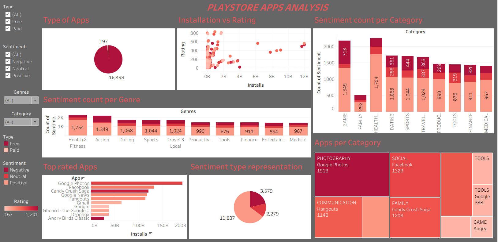

# 📱 Google Play Store App Insights Dashboard

This project is a Tableau-based interactive dashboard that explores trends in the Google Play Store — including installs, ratings, app categories, and app type (free vs paid).

## 🔗 Live Tableau Dashboard

[👉 View on Tableau Public](https://public.tableau.com/app/profile/barathbala.b/viz/GooglePlayDashboard_17508316470530/Dashboard1?publish=yes)

## 🔍 What It Shows

- 📊 App distribution by category
- ⭐ Rating distribution across all apps
- 🔥 Top installed apps
- 💰 Comparison of Free vs Paid apps
- 📈 Reviews vs Ratings correlation

## 📊 Tools Used

- Tableau Public (Dashboard)
- Python (for data cleaning using Pandas)
- Dataset: [Google Play Store - Kaggle](https://www.kaggle.com/datasets/lava18/google-play-store-apps)

## 📁 Files Included

| File | Description |
|------|-------------|
| `google_play_dashboard.twbx` | Tableau packaged dashboard (open in Tableau) |
| `googleplay_cleaned.csv`     | Cleaned dataset used in Tableau |
| `dashboard_screenshot.png`   | Preview of the dashboard |
| `README.md`                  | This project summary file |

## 🖼️ Dashboard Preview

